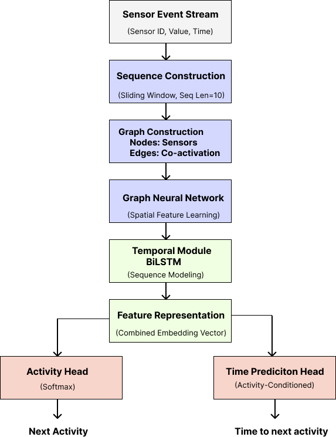
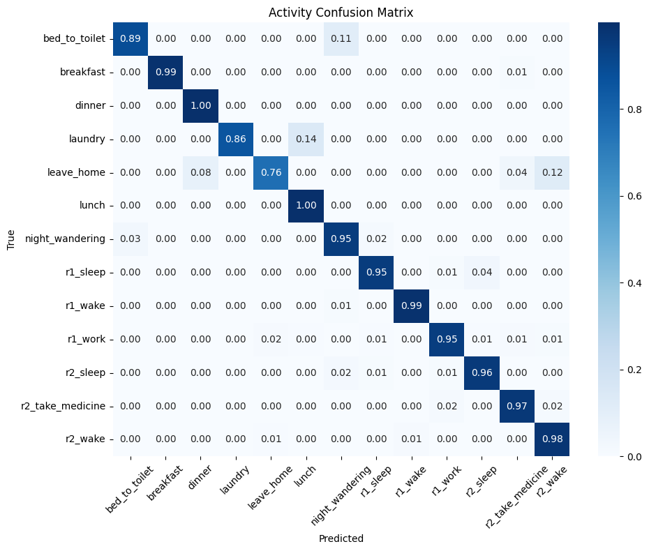
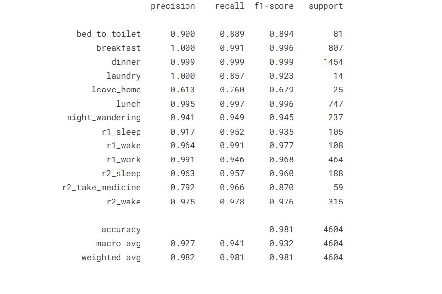
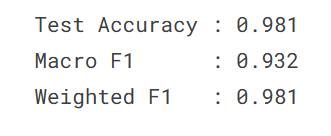
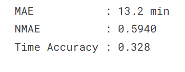

# Hybrid GNN + BiLSTM for Predictive Human Activity and Time Modeling


Human Activity Recognition (HAR) in smart environments has traditionally focused on identifying the current activity of a user based on sensor data. However, many real-world applications, such as assisted living, healthcare monitoring, and smart automation, require systems that go beyond recognition and enable anticipation of future actions.

In a smart home setup, ambient sensors continuously generate event streams reflecting user interactions with the environment. While it is feasible to infer the current activity from these signals, it remains significantly more challenging to:

  - Predict the next activity a user is likely to perform
  -  Estimate when that activity will begin

These two tasks - activity forecasting and time-to-event prediction, are critical for building proactive systems.

## Core Challenges
Several challenges make this problem non-trivial:

1. Temporal Dependency

Human activities are inherently sequential. The next activity depends not only on the current state but also on historical context over time.

2. Sensor Interaction Complexity

Smart home environments involve multiple sensors whose interactions form complex patterns. These relationships are better modeled as a graph structure rather than independent signals.

3. Uncertain Time Intervals

The time gap between activities is highly variable and often skewed, making continuous time prediction unstable without proper modeling.

4. Class Imbalance and Noise

Certain activities occur far more frequently than others, and sensor data may include noise or missing values, affecting model robustness.

## Objectives 

This project aims to design a system that:

- Predicts the next human activity from a sequence of sensor events
- Estimates the time until the next activity begins
- Effectively captures both:
    1. Spatial relationships between sensors
    2. Temporal dependencies across event sequences
 
## Approach Overview

To address these challenges, the problem is formulated as a multi-task learning problem combining:

  1. Activity classification (what happens next)
  2. Time prediction (when it happens)

The system leverages:

  - Graph-based modeling to capture sensor relationships
  - Sequence modeling to learn temporal patterns
  - Discrete time binning to stabilize time prediction

## Pipeline
The system is designed as a fully modular end-to-end pipeline:

1. Data Processing
    - Load raw sensor logs (CSV / TXT)
    - Clean and normalize sensor values
    - Encode categorical variables (sensor IDs, activities)
    - Generate temporal features:
        * time gaps (delta_t)
        * cyclic encoding (hour/day sin-cos)
        * previous activity context
2. Graph Construction
    - Build a sensor interaction graph using transition probabilities
    - Nodes = sensors
    - Edges = co-occurrence / transition strength
    - Graph captures spatial relationships between sensors
3. Sequence Generation
    - Convert event stream → sliding window sequences
    - Each window → graph representation
    - Target:
        * next activity label
        * time until next activity
4. Time Modeling
    - Continuous time → quantile-based bins
    - Solves skewed distribution problem
    - Enables stable classification-based prediction
5. Dataset + Dataloader
    - Custom SequenceDataset
    - Custom collate_fn for graph sequences
6. Training Pipeline
    - Two-stage training:
    - Activity prediction
    - Time prediction (conditioned on activity)
    - Class imbalance handling
    - Learning rate scheduling + early stopping
## Model Architecture

<p align="center">
  
  <br/>
  <em>Figure: Hybrid GNN + BiLSTM architecture for activity and time prediction</em>
</p>


The model combines graph learning + temporal modeling + multi-task prediction.

1. Graph Encoder (GNN)
    * Uses Graph Attention Network (GAT)
    * Captures:
      - sensor relationships
      - interaction patterns
  
    * Enhancements:
  
      - Sensor embeddings
      - Previous activity embeddings
  
    *  Output: graph-level embedding per timestep

2. Temporal Model (BiLSTM)
    * Processes sequence of graph embeddings
    * Learns:
      - temporal dependencies
      - activity transitions
  
    * Output: contextual sequence representation

3. Activity Prediction Head
    * Fully connected layer
    * Predicts next activity
    
4. Time Prediction (Key Innovation)
    * Instead of a single shared head - Activity-conditioned time prediction
    * Each activity has its own prediction head
    * Learns different temporal patterns per activity
  
    * Additional signals:
  
      - elapsed time
      - expected duration
      - dynamic progress
      
 5. Multi-task Learning

    * Simultaneously learns:
  
      - Activity classification
      - Time prediction
     
## Results

### Key Results

- Activity Accuracy: **~98%**
- Macro F1 Score: **~0.93**
- Weighted F1 Score: **~0.98**
- Time Prediction MAE: **~10-13 minutes**
- Time NMAE: **0.59**
- Time Bin Accuracy: **~32%**

The model is evaluated on:

1. Activity Prediction
   - Accuracy
   - Macro F1
   - Weighted F1
     
2. Time Prediction
   - Time bin accuracy
   - Mean Absolute Error (MAE)
   - Normalized MAE (NMAE)
     
3. Visualization
   - Confusion matrix (normalized)
   - Classification report


### Activity Classification Performance

<p align="center">
  
  <br/>
  <em>Figure: Confusion Matrix</em>
</p>

<p align="center">
  
  <br/>
  <em>Figure: Classification Report</em>
</p>

<p align="center">
  
  <br/>
  <em>Figure: Activity Metrics</em>
</p>

---

### Time Prediction Performance

<p align="center">
  
  <br/>
  <em>Figure: Time Metrics</em>
</p>

## Installation

Follow the steps below to set up the project locally.

### 1. Clone the repository

```bash
git clone https://github.com/your-username/your-repo-name.git
cd your-repo-name
```

### 2. Create a virtual environment

```bash
python -m venv venv
source venv/bin/activate      # Mac/Linux
venv\Scripts\activate         # Windows
```

### 3. Install dependencies

```bash
pip install -r requirements.txt
```

### 4. Install PyTorch Geometric

PyTorch Geometric requires a separate installation depending on your system.

CPU version:
```bash
pip install torch-scatter torch-sparse torch-cluster torch-spline-conv torch-geometric \
-f https://data.pyg.org/whl/torch-2.0.0+cpu.html
```
GPU version (example: CUDA 11.8):
```bash
pip install torch-scatter torch-sparse torch-cluster torch-spline-conv torch-geometric \
-f https://data.pyg.org/whl/torch-2.0.0+cu118.html
```
For other CUDA versions, refer to the [official PyTorch Geometric installation guide](https://pytorch-geometric.readthedocs.io/en/latest/install/installation.html).

### Verify installation

```bash
import torch
import torch_geometric

print(torch.__version__)
```
## 📂 Project Structure

```
project/
├── src/ # Core source code
│ ├── models/ # GNN, LSTM, time head
│ ├── data/ # preprocessing & loaders
│ ├── training/ # train & evaluation logic
│ ├── utils/ # helper functions
│ ├── features/ # feature engineering
│ ├── sequences/ # sequence building
│ ├── graph/ # graph construction
│
├── data/ # dataset (CSV files)
├── scripts/ # helper scripts 
├── configs/ # configuration files
├── outputs/ # results (metrics, plots)
├── assets/ # images (architecture diagrams)
├── streamlit_app/ # demo UI 
│
├── main.py # entry point
├── requirements.txt # dependencies
├── README.md
```
## Usage

Run the training pipeline:

```bash
python main.py --path data/cairo_labeled.csv --input_type csv
```
